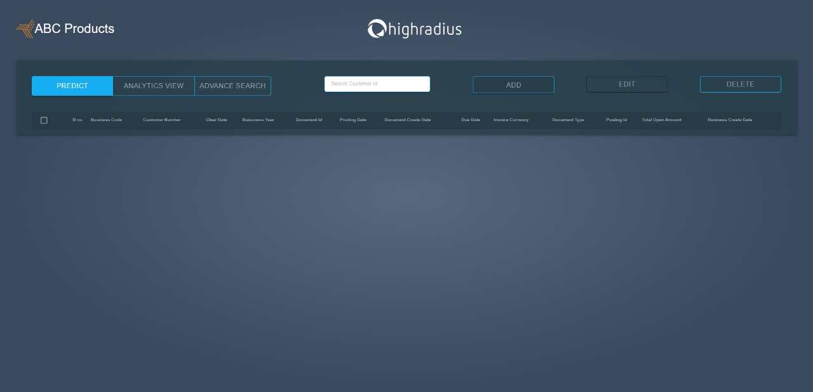
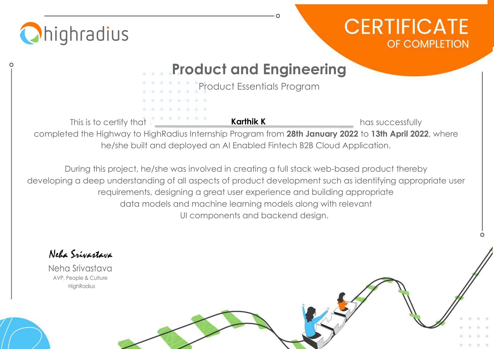

# AI-Enabled FinTech B2B Invoice Processing System

A full-stack Accounts Receivable (AR) platform built during the **HighRadius "HighWay to HighRadius" internship programme (2022)**. The system ingests SAP-style B2B invoice data, exposes a Java REST API, and serves a React dashboard where AR teams can view, add, edit, and delete invoices. A Python ML pipeline predicts the date each customer will actually pay, surfacing that prediction inline in the dashboard so collectors can prioritise follow-up on at-risk accounts.

---

## Finance Domain Context

| Term | Meaning in this project |
|------|-------------------------|
| **B2B Invoicing** | One business billing another for goods or services delivered |
| **Order-to-Cash (O2C)** | The end-to-end process from raising a sales order to receiving cash |
| **Accounts Receivable (AR)** | The seller's ledger of money owed by customers |
| **Payment terms** | Contractual deadline (e.g. NT30 = Net 30 days) per invoice |
| **Baseline / due date** | SAP date fields: *baseline* starts the payment clock; *due* is when it expires |
| **Predicted payment date** | ML output: the date the model estimates the customer will actually pay |

The dataset mirrors real SAP FI-AR exports (fields like `doc_id`, `posting_id`, `cust_payment_terms`, `baseline_create_date`), which is the standard data format used by enterprise ERP systems for cash-flow forecasting.

---

## Architecture

```
┌──────────────────────────────────────────────────┐
│  React Frontend  (localhost:3000)                │
│  • Invoice dashboard — paginated table           │
│  • Predicted Payment Date column (from ML)       │
│  • Add / Edit / Delete invoice modals            │
│  • Search by invoice number                      │
│  • Red highlight for overdue invoices            │
└───────────────────┬──────────────────────────────┘
                    │  HTTP / JSON  (CORS allowed)
┌───────────────────▼──────────────────────────────┐
│  Java Servlet Backend  (Apache Tomcat 9)         │
│                                                  │
│  GET  /DataRetrieval?page=N  → invoice JSON      │
│  GET  /InvoiceCount          → { total, pages }  │
│  POST /AddForm               → insert invoice    │
│  POST /EditInvoice           → update invoice    │
│  POST /DeleteInvoice         → delete invoice    │
└───────────────────┬──────────────────────────────┘
                    │  JDBC
┌───────────────────▼──────────────────────────────┐
│  MySQL  (grey_goose database)                    │
│  winter_internship  — main invoice ledger        │
│    ↑ predicted_payment_date written by ML model  │
└──────────────────────────────────────────────────┘
                    ↑
┌───────────────────┴──────────────────────────────┐
│  Python ML Pipeline  (Jupyter Notebook)          │
│  Data prep → Feature engineering →              │
│  Random Forest regression → write predictions   │
└──────────────────────────────────────────────────┘
```

---

## Project Structure

```
AI-Enabled-Fintech-B2B-Invoice-system/
├── schema.sql                          # DB setup — run this first
│
├── backend/                            # Java Servlet API (Apache Tomcat)
│   └── src/main/
│       ├── java/highradius/
│       │   ├── DBConnection.java       # JDBC factory (reads DB_* env vars)
│       │   ├── Response.java           # Invoice DTO / POJO
│       │   ├── DataRetrieval.java      # GET  /DataRetrieval?page=N
│       │   ├── InvoiceCount.java       # GET  /InvoiceCount
│       │   ├── AddForm.java            # POST /AddForm
│       │   ├── EditInvoice.java        # POST /EditInvoice
│       │   └── DeleteInvoice.java      # POST /DeleteInvoice
│       └── webapp/WEB-INF/
│           ├── lib/                    # Bundled JARs (Gson, Servlet API, MySQL driver)
│           └── web.xml                 # CORS filter + servlet config
│
├── frontend/                           # React dashboard (Create React App)
│   ├── package.json
│   ├── public/index.html
│   └── src/
│       ├── App.js                      # Root component — state + data fetching
│       ├── App.css                     # Dark navy theme
│       ├── components/
│       │   ├── Header.js
│       │   ├── InvoiceTable.js         # Paginated table with overdue highlighting
│       │   ├── AddInvoiceModal.js
│       │   └── EditInvoiceModal.js
│       └── services/api.js             # All fetch() calls in one place
│
├── ml/                                 # Python ML pipeline
│   ├── requirements.txt
│   ├── data/                           # Place invoices.csv here (not committed)
│   └── notebooks/
│       └── payment_date_prediction.ipynb
│
└── docs/
    └── frontend_screenshot.jpeg        # Dashboard UI screenshot
```

---

## Tech Stack

| Layer | Technology |
|-------|------------|
| Frontend | React 18, plain CSS |
| Backend | Java 8, Jakarta EE Servlet API 3.1 |
| Servlet container | Apache Tomcat 9 |
| JSON | Gson 2.8.2 |
| Database | MySQL 8 / JDBC (MySQL Connector/J 8.0.19) |
| ML | Python 3.9, scikit-learn, pandas, Jupyter |

---

## Prerequisites

| Tool | Minimum version |
|------|-----------------|
| Java JDK | 8 |
| Apache Tomcat | 9 |
| MySQL | 8 |
| Node.js | 14.17 |
| npm | 6+ |
| Python | 3.6 |

---

## Setup & Run

### 1. Database

```bash
mysql -u root -p < schema.sql
```

This creates the `grey_goose` database and seeds four sample rows (matching the screenshot above).

### 2. Backend — environment variables

```bash
# Linux / macOS
export DB_URL=jdbc:mysql://localhost:3306/grey_goose
export DB_USER=your_mysql_user
export DB_PASSWORD=your_mysql_password
```

```powershell
# Windows PowerShell
$env:DB_URL      = "jdbc:mysql://localhost:3306/grey_goose"
$env:DB_USER     = "your_mysql_user"
$env:DB_PASSWORD = "your_mysql_password"
```

### 3. Backend — deploy to Tomcat

**Eclipse (recommended):**
1. Import `backend/` as an existing project.
2. Add the JARs in `WEB-INF/lib/` to the build path.
3. Add a Tomcat 9 server and deploy the project.
4. Start Tomcat — API is live at `http://localhost:8080/invoice-system/`.

**Verify:**
```bash
curl "http://localhost:8080/invoice-system/DataRetrieval?page=1"
# → JSON array of invoice records
```

### 4. Frontend

```bash
cd frontend
npm install
npm start
# → Opens http://localhost:3000
```

### 5. ML pipeline (optional — to generate predictions)

```bash
cd ml
pip install -r requirements.txt

# Export the DB table to CSV first (or let the notebook connect directly)
jupyter notebook notebooks/payment_date_prediction.ipynb
```

Run all cells in order. The final cells write `predicted_payment_date` back to MySQL and save a `data/predictions.csv`.

---

## API Reference

| Method | Endpoint | Params | Returns |
|--------|----------|--------|---------|
| GET | `/DataRetrieval?page=N` | `page` (1-indexed) | JSON array, 10 invoices |
| GET | `/InvoiceCount` | — | `{ total, pages }` |
| POST | `/AddForm` | `custName, custId, invNo, invAmt, dueDa, not` | — |
| POST | `/EditInvoice` | `sl_no, custName, invAmt, dueDa, not` | `{ status }` |
| POST | `/DeleteInvoice` | `sl_no` | `{ status }` |

---

## ML Model — Payment Date Prediction

**Problem type:** Regression — predict `payment_delay_days` (positive = late, negative = early).

**Features used:**

| Feature | Derivation |
|---------|------------|
| `amount` | Numeric invoice amount |
| `days_to_due` | `due_in_date − document_create_date` |
| `baseline_slack` | `due_in_date − baseline_create_date` |
| `due_month` | Month of due date (seasonality) |
| `terms_days` | Numeric value extracted from payment terms (NT30 → 30) |
| `doc_type_enc` | Label-encoded document type |

**Models compared:** Linear Regression vs Random Forest Regressor (100 estimators).

**Output:** `predicted_payment_date = due_in_date + predicted_delay_days`, written to `winter_internship.predicted_payment_date` and surfaced in the dashboard.

---

## Screenshots



---

## Internship Certificate



> **Karthik K** — Certificate of Completion, HighRadius "Highway to HighRadius" Internship Programme  
> Product & Engineering · Product Essentials Program · 28 Jan 2022 – 13 Apr 2022

---

## License

MIT — see [LICENSE](LICENSE).
